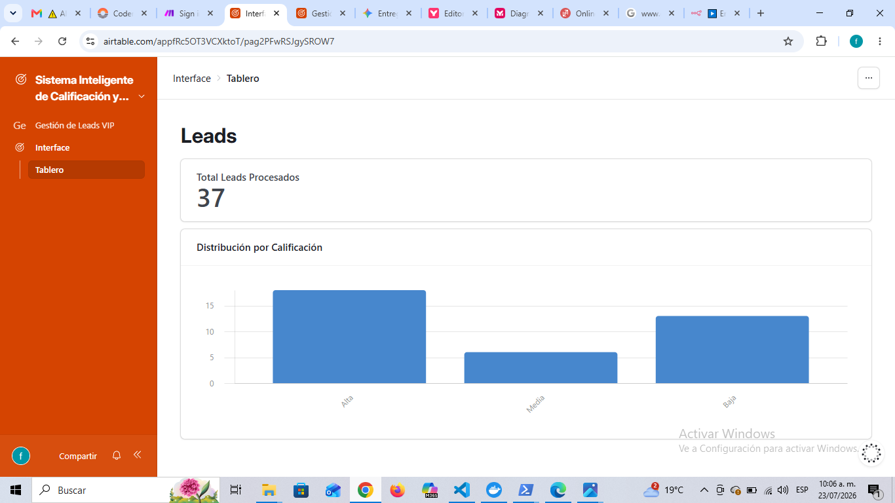

# Sistema Inteligente de Calificación y Nutrición de Leads VIP

## 📌 Descripción del Proyecto
Este proyecto implementa un flujo de trabajo automatizado en **n8n** que recibe potenciales clientes (leads) a través de un Webhook, valida sus datos y presupuesto, los califica utilizando **IA (Google Gemini)** y registra la información estructurada en **Airtable**. Además, cuenta con un sistema de notificaciones **HITL (Human-in-the-Loop)** por correo electrónico y gestión de errores.

---

## 🛠️ Malla de Integraciones
* **Activador:** Webhook (POST) para recepción de datos.
* **Validación:** Nodo IF para filtrado por presupuesto (`$json.body.presupuesto >= 1000`) y email no vacío.
* **IA / LLM:** Agent AI con Google Gemini Chat Model para análisis de la necesidad.
* **Base de Datos:** Airtable (Gestión de estados: *En Revisión Humana*, *Descalificado*, *Error*).
* **Notificaciones:** Envío de correo electrónico SMTP para alertas HITL.
* **Resiliencia:** Error Trigger para captura global de fallos.

---

## 🔗 Enlaces Obligatorios y Evidencias

* 📊 **Base de Datos (Airtable - Modo Lectura):** [Ver Base de Datos de Leads en Airtable](https://airtable.com/appfRc5OT3VCXktoT/shrC143E7etGz6PGQ)

### 📸 Evidencias de Funcionamiento

* **Camino Feliz (Aprobado VIP):**  
  .PNG)

* **Camino Descalificado (Presupuesto Bajo):**  
  .PNG)

* **Notificación HITL (Correo):**  
  .PNG)

* **Tablero de Registros:**  
  

---

## 🚀 Instrucciones de Uso
1. Importar el archivo `Entrega Final_ AI Automation plano.json` en n8n.
2. Configurar las credenciales de **Google Gemini API**, **Airtable** y **SMTP**.
3. Activar el flujo y enviar un HTTP POST al punto final del Webhook.

